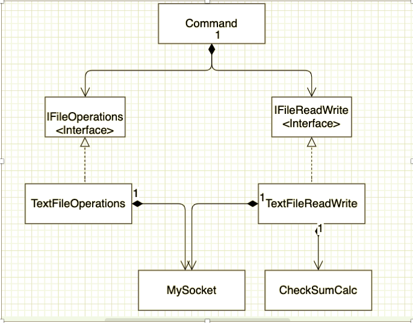

The requirement to create a file store service, has been achieved using java APIs. The architecture diagram of the client , along with various design assumptions have been described in this document.

The code was developed on a Intellij IDE environment.

**Client side design**

**Execution instructions.**

The client side can be executed from the command prompt by going to the directory where the FileClient.class is located and running the command

To add/update a file

java FileClient add input_file_absolute_path

To remove a file

java FileClient rm input_file_absolute_path

To list files in server

java FileClient ls

To get word count

java FileClient wc

To get freq-words

java FileClient freq-words

**Assumptions made**

->	Add and update functionality have been merged into one. If a file already exists on the server, then the file will not be retransmitted

->	If an existing file, with a different content is added, then the existing file is updated.

->	ls , wc and freq-words will consider all the files in the current directory of the server. This will include files which are not created by the client.

->	Have currently only considered text files.

->	Using SHA-256 for checksum calculation.

->	Assuming the client and server are present on localhost. Hence using HOST as localhost and port as 1988

->	Sending files in chunks of 1024 bytes
